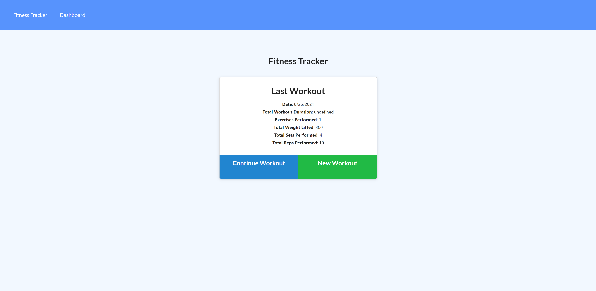
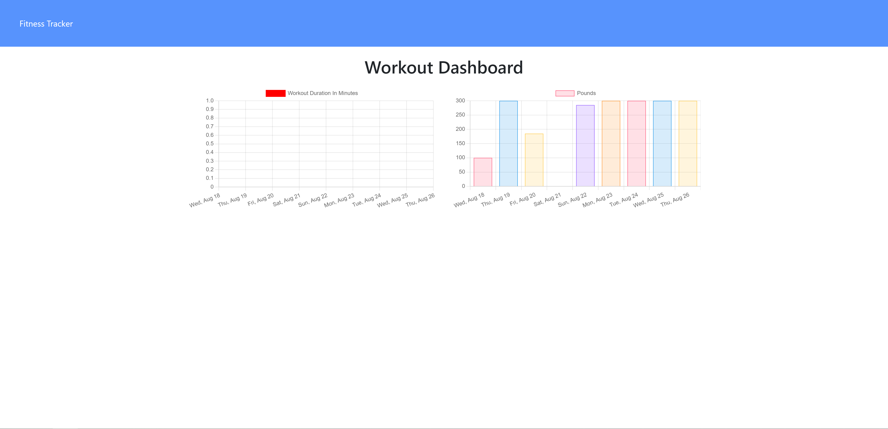

# Workout Tracker

## Table of Contents:

### [Description](#description-header)

### [Installation](#installation-header)

### [Usage](#usage-header)

### [Licence](#licence-header)

### [Credits](#credits-header)

### [Questions](#questions-header)

---

 

##  Description

As a means of learning to use routes and practicing with NoSQL Databases such as MongoDB and Mongoose, the back-end was added to a budget tracker.

This application tracks a user's current exercise routiens and logs them for future reference.

 

##  Installation

No installation necessary! To access the application, click here.

 

##  Usage

The application should be fairly intuitive! Click on the "New Workout" to add an exercise routine and clickk "Complete" when finished. Click on the Dashboard for an overview of one's exercise routine. 

---

---

 

##  Credits

Credit goes to the UT at Austin Bootcamp for providing instruction and tools for learning their course on 'Full-Stack Web Development.'

 

##  Licence

Workout Tracker is released under the MIT licence.

 

##  Questions

For more information and suggestions you can contact me at ca.perez.barr.dev@gmail.com.

For a list of other projects and repos visit https://github.com/cperezba

---
